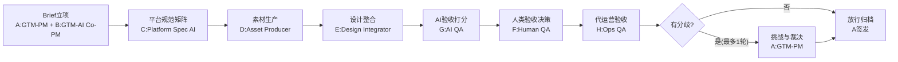

# Asset Factory v1 SOP（岗位协议版）

版本：v1.0  
适用范围：国内（天猫/京东/抖音/小红书/得物）与跨境（Amazon/Shopify/TikTok Shop）电商GTM物料  
节奏：双周（主），月度（复盘）

## 0. 目标与边界
- 目标1：从需求立项到可上架物料包，标准周期 <= 72小时。
- 目标2：人类验收与AI验收双通过后放行。
- 目标3：周开娇（岗位：GTM-PM）从执行中抽离，聚焦节奏、质量、跨板块协同。
- 目标4：先确保GTM表达准确（人群-场景-痛点-卖点-证据），再追求经营指标优化。
- 目标5：验收采用三重机制（AI QA + Human QA + 代运营Ops QA），保证“可发布”且“可运营”。
- 边界：本流程不负责广告投放执行，仅负责可投放资产的标准化交付。

## 1. 岗位定义（按岗位，不按人）
- 岗位A：GTM-PM（人类主岗）
  - 负责：立项、目标定义、资源分配、进度控制、冲突决策。
- 岗位B：GTM-AI Co-PM（AI B岗）
  - 负责：范围偏差预警、风险清单、节奏提醒、平台要求映射校验。
- 岗位C：Platform Spec AI（平台规范AI岗）
  - 负责：在Brief后立即输出各平台规格与素材要求矩阵。
- 岗位D：Asset Producer（素材生产岗）
  - 负责：拍摄、AI出图、基础视频素材、文案初稿。
- 岗位E：Design Integrator（设计整合岗）
  - 负责：版式、比例、视觉一致性、卖点结构化呈现。
- 岗位F：Human QA（人类验收岗）
  - 负责：商业合理性、品牌调性、业务放行判断。
- 岗位G：AI QA（AI验收岗）
  - 负责：规则、一致性、转化导向评分及挑战发起。
- 岗位H：Ops QA（代运营验收岗）
  - 负责：运营可用性验收（投放落地、页面引导、活动承接、执行阻力）。

## 2. 流程总览（先规则，后生产）
1. Brief立项（T+0h）
2. 平台规范矩阵生成（T+2h内，Platform Spec AI）
3. 素材生产（T+2h~T+36h）
4. 设计整合（T+24h~T+54h）
5. 三重验收（AI QA -> Human QA -> Ops QA，T+54h~T+68h）
6. 1轮挑战与裁决（如有分歧，T+68h~T+71h）
7. 放行与归档（T+72h）

## 3. 关键机制

### 3.1 GTM双岗机制（A+B）
- A岗（人类）给目标和优先级；B岗（AI）持续检查“是否偏离目标”。
- B岗每12小时输出一次偏差报告：
  - 范围偏差：新增需求是否未经立项。
  - 进度偏差：是否会破坏72小时交付。
  - 质量偏差：是否存在高概率验收失败项。

### 3.2 平台前置机制（你问的“无矩阵，不允许进入生产”）
- 含义：Brief完成后，必须先生成《平台规范矩阵》，否则流程不能进入素材生产环节。
- 目的：把“平台比例、格式、长度、禁用规则、必备素材类型”提前锁定，避免后续返工。
- 这是一道门禁，不是建议项。
- Brief完成后，先产出《平台规范矩阵》，再进入素材生产。
- 平台规范矩阵至少包含：
  - 图片/视频比例与方向（横/竖）
  - 分辨率、时长、大小限制
  - 标题/卖点/敏感词边界
  - 主图、详情、短视频、直播切片等资产类型需求
- 无矩阵，不允许进入生产。

### 3.3 双验收制衡
- AI QA先审并打分，Human QA复审，Ops QA终审运营可用性。
- 允许互相挑战，仅1轮，避免循环拉扯。
- 决策优先级：
  1) 明确平台硬规则
  2) 法务与合规约束
  3) 商业目标与品牌一致性
  4) 运营可执行性与转化承接

### 3.4 GTM全资产范围（本流程交付物）
- 电商资产：KV图（SKU主视觉海报）、主图、白底图、卖点图、详情页、主图视频、短视频切片。
- 销售资产：产品单页（CN+EN）。
- 产品资料资产：产品手册（内容由产品部门提供，GTM负责结构化与表达转换，CN+EN）。
- 投放协作资产：达人Brief（KOL/KOC用）。
- AI资产执行包：每类关键资产必须包含图片说明、版式说明、文案落位、卖点证据映射、AI生图Prompt。
- 无上述清单映射，不允许立项通过。

### 3.5 AI资产执行包（减少人类生图负担）
- 覆盖资产：KV图、主图组、详情页关键画面、视频关键帧。
- 每个资产至少输出5项：
  - 画面说明（主体、场景、构图、镜头）
  - 版式说明（标题/副标题/权益/证据区块落位）
  - 文案落位（每个文本对应画面位置）
  - 卖点-证据映射（每个卖点对应证据）
  - 生图Prompt（可直接投喂）
- 生图Prompt要求：
  - 主提示词（风格、主体、场景、光线、构图）
  - 负面提示词（避免畸形手、文字乱码、Logo错误等）
  - 比例参数（按平台矩阵）
  - 迭代建议（如果失败优先改哪些词）

## 4. 72小时里程碑（标准）
- T+0h：立项完成（Brief完整率100%）
- T+2h：平台规范矩阵完成
- T+36h：素材初版齐套
- T+54h：设计整合完成
- T+68h：AI+Human+Ops首轮验收完成
- T+71h：挑战裁决完成（如触发）
- T+72h：上架包放行

## 5. 评分与放行标准
- 评分分两层：
  1) 单一资产评分（Asset-level）：每个资产独立评分与放行。
  2) SKU完整性评分（SKU-level）：基于所有资产汇总评分，决定SKU是否可发布。
- Human QA可提交Ops QA条件：
  - Asset-level关键资产（KV/主图/详情页）均>=85
  - 红线项=0
  - 关键转化资产齐套（KV/主图/详情/短视频至少1套）
- Ops QA可放行条件：
  - Asset-level Ops评分关键资产均>=80
  - SKU-level Ops评分>=80
  - 活动/投放承接阻断项=0

## 6. RACI（简版）
- 立项：A负责，B协同
- 平台规范矩阵：C负责，A审核
- 素材生产：D负责，A跟踪
- 设计整合：E负责，A跟踪
- AI验收：G负责
- 人类验收：F负责
- 代运营验收：H负责
- 最终签发：A负责

## 7. 首轮试跑范围
- 建议SKU：母婴亲子版（国内电商）
- 周期：1个双周周期
- 试跑成功判定：
  - 72小时按时交付率 >= 80%
  - 返工率 <= 20%
  - AI/人类验收分歧率 <= 30%

## 8. RACI流程图（可视化）

