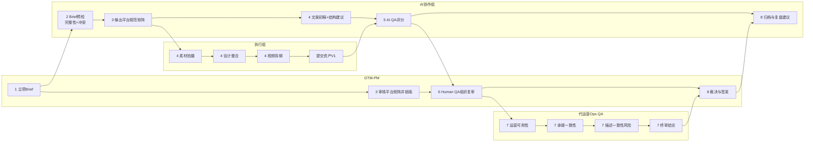

# SKU GTM资产产出流程（漫画版）

用途：给GTM-PM、执行同学、代运营团队快速对齐流程与分工。  
阅读时长：3分钟。

---

## 角色表（先认人）
- 角色A：GTM-PM（项目导演）
  - 负责：立项、优先级、平台与资产范围锁定、裁决、签发。
- 角色B：执行组（拍摄/设计/剪辑）
  - 负责：把策略变成可发布资产。
- 角色C：代运营（Ops QA）
  - 负责：判断能不能稳定投放和承接，拦截“描述不符”风险。
- 角色D：AI协作组（Co-PM + Platform Spec + AI QA）
  - 负责：预检、规则、评分、风险证据。

---

## 八格漫画分镜

### 第1格：立项开场
- 画面：GTM-PM拿着新SKU卡片说“开机”。
- 台词：
  - GTM-PM："这是P0项目，平台天猫+京东+抖音，资产做KV/主图/详情/视频。"
  - GTM-PM："CN必交，EN这轮可选。"
- 输出：Brief v1。

### 第2格：AI预检
- 画面：AI像质检员扫描Brief。
- 台词：
  - AI："我先查五件事：人群、场景、痛点、卖点、证据。"
  - AI："发现冲突：卖点A与痛点B不匹配，建议修正。"
- 输出：Brief完整性报告 + 冲突清单。

### 第3格：平台规则上锁
- 画面：AI展开“平台规范矩阵”，GTM-PM盖章。
- 台词：
  - AI："这是各平台尺寸、禁用词、必备资产清单。"
  - GTM-PM："确认锁版，未锁版不许开工。"
- 输出：平台规范矩阵（锁版）。

### 第4格：执行组生产
- 画面：拍摄、设计、剪辑三位执行并行工作。
- 台词：
  - 执行组："按矩阵做KV、主图、详情、视频。"
  - AI："我给文案初稿和结构建议，并做卖点-证据映射检查。"
- 输出：资产V1包。

### 第5格：AI QA先审
- 画面：AI打分面板亮起。
- 台词：
  - AI："资产级评分开始：AI>=85才可进下一关。"
  - AI："这两处扣分：证据弱、叙事不一致。"
- 输出：AI评分报告（逐项扣分证据）。

### 第6格：Human QA复审
- 画面：GTM-PM与评审同学看同一张评分表。
- 台词：
  - Human QA："商业合理性、品牌调性、竞争力表达是否成立？"
  - GTM-PM："成立则流转代运营终审。"
- 输出：Human QA结论。

### 第7格：Ops QA终审
- 画面：代运营拿着“投放承接雷达图”。
- 台词：
  - Ops："我重点看三件事：能不能投、能不能接、会不会描述不符。"
  - Ops："Ops>=80才算过，描述不符风险一票否决。"
- 输出：Ops QA结论（通过/退回）。

### 第8格：裁决与签发
- 画面：GTM-PM做最终拍板，AI同步归档。
- 台词：
  - GTM-PM："通过就签发上线；不通过进48小时整改。"
  - AI："我已归档扣分TOP项，进入双周复盘。"
- 输出：签发单 + 复盘记录。

---

## 一张图看全流程（泳道图）

---

## 通过标准（给全员记一句）
- 资产级通过：AI>=85，Human通过，Ops>=80，且无红线。  
- SKU级通过：KV/主图/详情全部通过，才允许签发。

---

## 每个角色只做一件最重要的事
- GTM-PM：做决策，不做执行。
- 执行组：按锁版标准生产，不猜需求。
- 代运营：守住“可投放且不引发描述不符”。
- AI：提前发现问题，给证据，不替代最终业务决策。
